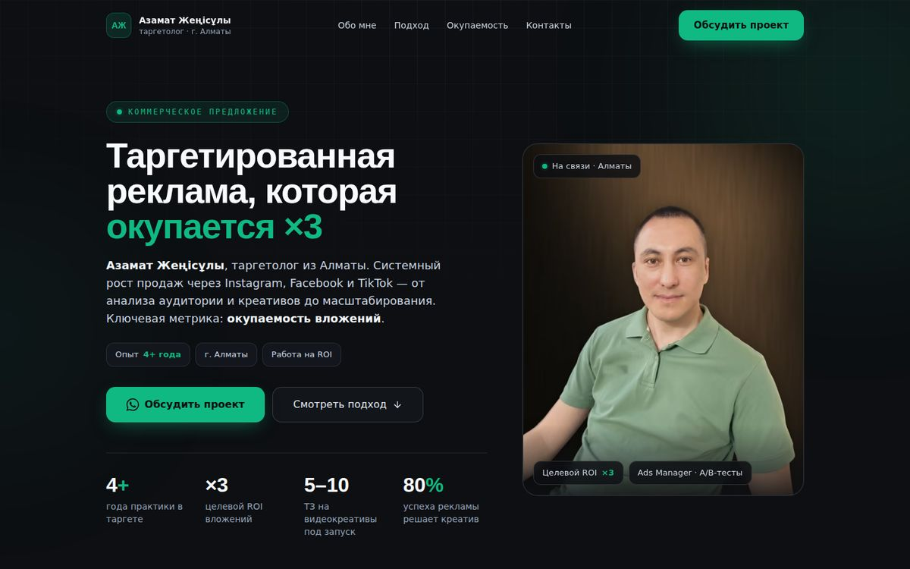
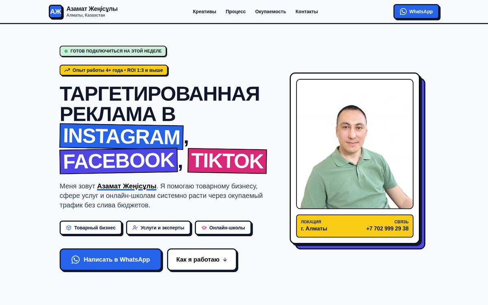
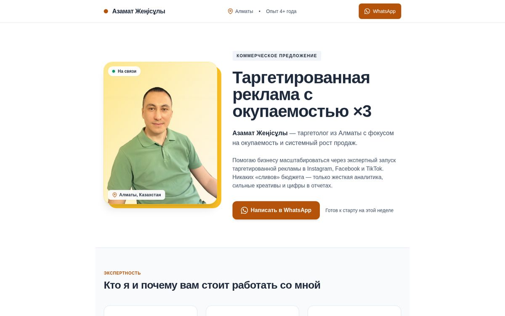

<div align="center">



# Мини-портфолио · Алтын Клик

**Три одностраничных сайта на одной странице.**
Визитка специалиста, свадебное приглашение и приглашение на детский праздник. Переключаются вкладками.

[](https://azamat-targetolog.pages.dev/)


</div>

---

## Работы

| | Проект | Задача и решение | Ссылка |
|:-:|---|---|---|
|  | **1 · Сайт таргетолога** | Визитка и коммерческое предложение для таргетолога из Алматы. Графитовый фон, изумрудный акцент, портрет на бронзовом фоне, калькулятор окупаемости, заявки в WhatsApp | [v1](https://azamat-targetolog.pages.dev/v1) |
|  | **2 · Свадьба** | Приглашение «Айгерим & Тимур». Гранатовый, шафрановый и бирюзовый цвета, казахский орнамент. Внутри история пары, программа дня, дресс-код, рассадка, вишлист с бронированием подарков и анкета гостя | [v2](https://azamat-targetolog.pages.dev/v2) |
|  | **3 · День рождения** | «Мирону 7»: космическая вечеринка для детей. Обратный отсчёт до старта, программа, список гостей, подарки, пожелания и анкета в виде посадочного талона | [v3](https://azamat-targetolog.pages.dev/v3) |

[`index.html`](index.html) переключает работы вкладками. У каждой своя ссылка через хэш: `/#v1`, `/#v2`, `/#v3`.

## Что внутри

### 1 · Сайт таргетолога
- **Продающая структура:** оффер, «Обо мне», система из 7 шагов, окупаемость, контакты, кнопка WhatsApp.
- **Калькулятор ROI:** ползунок бюджета показывает целевой возврат ×3 и чистую прибыль.
- **Скорость:** портрет в AVIF / WebP / JPEG с `srcset`, `fetchpriority="high"` для LCP, минифицированный CSS из Tailwind.

### 2 · Свадьба
- **Обратный отсчёт** до церемонии, на первом экране анимация лепестков.
- **Анкета гостя:** придёт или нет, сколько человек, выбор блюда, место в автобусе, песня для танцпола, пожелание.
- **Вишлист:** гость бронирует подарок, чтобы его не купили дважды.
- **Сводка для пары:** сколько гостей придёт, какие блюда выбрали, сколько мест нужно в автобусе.
- **Пасхалка:** нажмите на «&», и на экран посыплется шашу.

### 3 · День рождения
- **Обратный отсчёт до праздника.** В сам день праздника текущий пункт программы подсвечивается автоматически.
- **Список гостей:** статус каждого ребёнка и итог, сколько придёт детей и взрослых.
- **Анкета:** после отправки гость получает «посадочный талон» с печатью «НА БОРТУ».
- **Подарки и пожелания:** бронь подарков и «бортовой журнал» с пожеланиями.
- **Пасхалки:** ракету можно запустить, а семь свечей задуть.

### Общее для всех работ
- **Доступность:** семантическая разметка, `aria`-вкладки с управлением стрелками, видимый фокус, поддержка `prefers-reduced-motion`, переключатель «Спокойный режим» без анимаций.
- **Светлая и тёмная темы** в приглашениях: страницы следуют системной настройке.
- **Без внешних данных:** если общей базы нет, ответы гостей сохраняются локально или отображаются текстом, который можно скопировать и отправить в мессенджер.
- **Превью ссылок:** Open Graph-теги на каждой странице.
- **Безопасность:** заголовки CSP, `X-Frame-Options`, `Referrer-Policy` и `Permissions-Policy` в файле [`_headers`](_headers).

## Структура

```
.
├── index.html            # tab switcher between the three works
├── v1.html / v1.css      # targetologist business-card site (Tailwind)
├── v2.html               # wedding invitation (self-contained, inline CSS/JS)
├── v3.html               # kids birthday invitation (self-contained, inline CSS/JS)
├── azamat-dark-*.{avif,webp,jpg}  # portrait for v1
├── og-card.jpg           # link preview image (baseline JPEG)
├── docs/                 # README screenshots
├── _headers              # Cloudflare Pages security headers
└── tailwind/             # Tailwind config and build script for v1
```

## Общая база для приглашений (v2 и v3)

Ответы гостей и бронь подарков хранятся в Cloudflare D1. API лежит в [`functions/api/[[path]].js`](functions/api/%5B%5Bpath%5D%5D.js) и работает на том же домене: `/api/wed/…` для свадьбы, `/api/m7/…` для дня рождения.

- **Гости без аккаунтов.** Браузер хранит случайный `guest_id`, по нему гость видит и меняет только свой ответ и свои подарки.
- **Бронь подарка атомарная:** два гостя не смогут занять один подарок.
- **Приватные поля** (заметки организаторам, блюдо, трансфер, песня) отдаются только по секретному ключу. Родители и молодожёны открывают страницу один раз со ссылкой `/v3?key=…` или `/v2?key=…`.
- **Без базы** страницы не ломаются: ответ сохраняется на устройстве или показывается текстом для копирования.

Настройка один раз: создать базу D1 `invites`, выполнить [`schema.sql`](schema.sql) в консоли, в Pages → Settings → Bindings добавить D1 с именем `DB`, в Variables and Secrets добавить секрет `OWNER_KEY`, затем пересобрать проект.

## Сборка CSS

HTML можно править напрямую. Tailwind нужен только для работы 1. Если в ней меняются классы, пересоберите CSS:

```bash
cd tailwind
npm install
npm run build
```

## Деплой

Это статика без шага сборки: Cloudflare Pages раздаёт корень репозитория.
Build command: пусто · Output directory: `/`.

Локальный просмотр:

```bash
npx serve .
```

---

<div align="center">

Разработка — **[Алтын Клик](https://github.com/Nutamy)** · лендинги и сайты для малого бизнеса и событий в Алматы

<sub>© 2026 Алтын Клик. Имена, тексты и фотографии в работах демонстрационные или принадлежат заказчикам.</sub>

</div>
